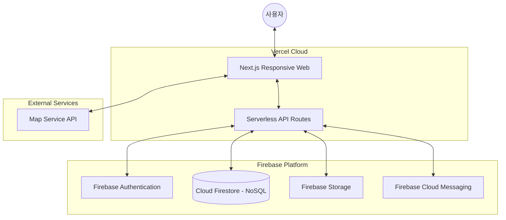

# 하이레벨 아키텍처 설계 (HLD) - Firebase 기반

## 1. 개요
본 문서는 2030 여행자를 위한 SNS 커뮤니티의 전체적인 시스템 구조와 기술 스택을 정의합니다. 사용자의 요구사항에 따라 **비용 최적화(Firebase 무료 티어 활용)**와 **웹 기반 반응형 디자인**에 초점을 맞추었습니다.

## 2. 기술 스택 (Tech Stack) 및 선정 근거

| 레이어 | 기술 | 선정 근거 (Trade-off) |
| :--- | :--- | :--- |
| **Frontend** | **Next.js (React)** | SSR/SSG 지원으로 SEO에 최적화, 반응형 웹 구현 용이, Vercel 무료 배포 가능 |
| **Backend/DB** | **Firebase** | Google에서 제공하는 NoSQL DB(Firestore), 인증(Auth), 파일 저장소(Storage), 푸시 알림(FCM) 통합 제공 |
| **API** | **Next.js API Routes** | 별도의 서버 구축 없이 배포 가능 (Serverless), 비용 절감 |
| **Mapping** | **Mapbox/Google Maps** | 풍부한 SDK와 지리 정보 제공 (일정 트래픽까지 무료) |
| **Deployment** | **Vercel** | Next.js와 최상의 호환성, 무료 SSL 및 호스팅 제공 |

## 3. 시스템 구성도 (System Architecture)

## 4. 데이터 흐름
1. **게시물 작성**: 사용자가 이미지를 업로드하면 Firebase Storage에 저장되고, 텍스트와 비용 정보는 Firestore(NoSQL)에 문서 단위로 저장됩니다.
2. **지도 표시**: Firestore의 위치 정보를 실시간으로 가져와 Map SDK를 통해 지도 위에 경로를 연결합니다.
3. **정산 알림**: FCM(Cloud Messaging)을 통해 그룹 멤버들에게 즉각적인 정산 상태를 푸시 알림으로 공유합니다.

## 5. 비용 절감 전략
- **Spark Plan (Free)**: Firebase의 무료 티어(Spark 요금제)를 활용하여 초기 비용 부담 없이 시작합니다.
- **NoSQL 최적화**: 읽기/쓰기 횟수에 따라 비용이 발생하는 Firestore의 특성에 맞춰 쿼리 최적화 및 인덱싱 전략을 수립합니다.
