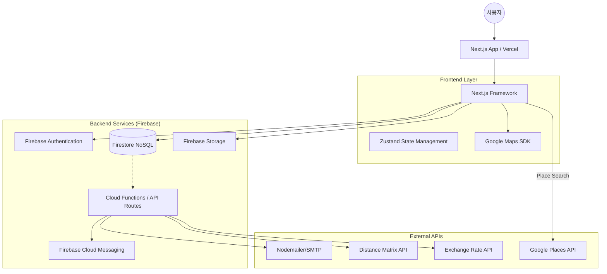

# [HLD] HANS SNS 하이레벨 아키텍처 설계서

## 1. 시스템 아키텍처 개요
본 시스템은 **Serverless 기반의 이벤트 중심 아키텍처**를 채택하여 초기 개발 속도를 극대화하고, 트래픽 확장에 유연하게 대응합니다. Next.js를 프론트엔드로, Firebase를 백엔드 및 실시간 인프라로 활용합니다.

## 2. 시스템 구성 요소 (Mermaid)

## 3. 기술 스택 및 선택 근거

| 분류 | 기술 스택 | 선택 근거 (Trade-off) |
| :--- | :--- | :--- |
| **Framework** | Next.js 15+ | SSR/ISR을 통한 SEO 최적화 및 빠른 초기 로딩 속도 확보. API Routes를 통해 서버 로직 통합 관리 가능. |
| **Backend** | Firebase | 인프라 관리 비용 최소화. Firestore의 리얼타임 리스너를 통한 그룹 동시 편집 및 정산 상태의 실시간 동기화 용이. |
| **Database** | Firestore (NoSQL) | 여행 데이터(게시물, 경로, 지출 등)의 비정형적이고 잦은 스키마 변경에 유연하게 대응 가능. |
| **State Management** | Zustand | Redux 대비 가볍고 설정이 간편하며, Next.js의 Client Component에서 전역 상태(사용자 정보, 그룹 정보) 관리에 적합. |
| **Map Engine** | Google Maps | 전 세계적인 장소 데이터 정확도 및 경로 탐색 API(Distance Matrix)와의 높은 시너지. |

## 4. 데이터 흐름 디자인

### 4.1 실시간 그룹 협업 및 정산
- 사용자가 게시물을 작성하거나 지출 내역을 입력하면 Firestore의 해당 그룹 문서가 업데이트됩니다.
- 같은 그룹에 속한 멤버들의 앱은 Firestore의 `onSnapshot` 리스너를 통해 실시간으로 변경 사항을 감지하고 UI를 갱신합니다.

### 4.2 경로 최적화 및 시각화
- 본문에 포함된 `#장소` 태그는 Google Places API를 통해 위/경도로 변환됩니다.
- Cloud Functions에서 방문 순서에 따른 총 이동 거리와 소요 시간을 계산하여 효율적인 동선 피드백을 제공합니다.

### 4.3 푸시 알림 및 외부 연동
- 특정 이벤트(태깅, 정산 요청) 발생 시 Cloud Functions 트리거가 실행됩니다.
- FCM을 통해 브라우저 푸시 알림을 발송하고, 중요도가 높은 내용은 Nodemailer를 통해 메일로 전송합니다.

---
**이 설계안이 프로젝트 방향과 일치한다면, 다음 단계인 [상세 설계(LLD): 데이터베이스 스키마 및 API 명세]를 작성하겠습니다.**
