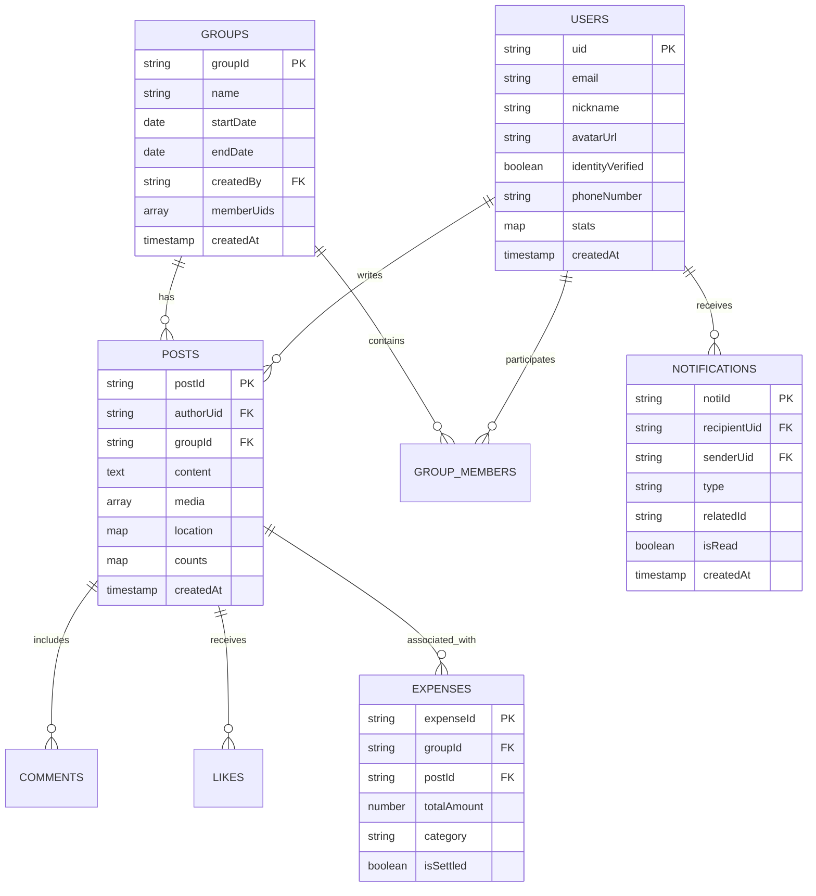

# 상세 설계 (LLD): 데이터베이스 및 데이터 보안

## 1. 개요
본 문서는 Firebase Cloud Firestore(NoSQL)를 기반으로 한 SNS 서비스의 상세 데이터 구조를 정의합니다. 대규모 확장성과 실시간 인터랙션, 그리고 보안을 고려하여 설계되었습니다.

## 2. ER 다이어그램 (ER Diagram)

NoSQL인 Firestore 환경이지만, 데이터 간의 논리적 관계를 명확히 하기 위해 ERD로 시각화하였습니다.

## 3. 컬렉션 구조 (Firestore Schema)

### 2.1 `users` 컬렉션
사용자 기본 정보 및 인증 상태를 관리합니다.
- `{uid}` (DocumentID): Firebase Auth UID
    - `email`: string (로그인 이메일)
    - `nickname`: string (고유 닉네임)
    - `avatarUrl`: string (프로필 이미지 경로)
    - `bio`: string (필트 한줄 소개)
    - `travelStyleTags`: array<string> (예: ["#배낭여행", "#식도락"])
    - `identityVerified`: boolean (**추가: 본인 확인 여부**)
    - `phoneNumber`: string (**추가: 본인 확인 전화번호**)
    - `stats`: map (통계 데이터)
        - `totalPosts`: number
        - `totalCountries`: number
        - `totalDistance`: number
    - `createdAt`: serverTimestamp
    - `updatedAt`: serverTimestamp

### 2.2 `groups` 컬렉션
여행 그룹 정보를 관리합니다.
- `{groupId}` (DocumentID)
    - `name`: string
    - `description`: string
    - `startDate`: date
    - `endDate`: date
    - `createdBy`: string (UID)
    - `memberUids`: array<string> (멤버 조회 최적화용 UID 배열)
    - `status`: string (active/finished)
    - `createdAt`: serverTimestamp

### 2.3 `posts` 컬렉션
여행 기록인 게시물 정보를 관리합니다.
- `{postId}` (DocumentID)
    - `authorUid`: string (작성자 ID)
    - `groupId`: string (그룹 소속 시 그룹 ID, null 가능)
    - `content`: text
    - `media`: array<map> (사진/영상 정보)
        - `url`: string
        - `type`: string (image/video)
    - `location`: map (태그 기반 위치 정보)
        - `tag`: string (예: "#제주도")
        - `geopoint`: geopoint (위경도)
        - `placeName`: string (실제 주소/장소명)
    - `expenses`: array<map> (비용 정보)
        - `category`: string (항공/숙박/식비 등)
        - `amount`: number
        - `currency`: string (KRW 등)
    - `visibility`: string (public/followers/group/private)
    - `counts`: map
        - `likes`: number
        - `comments`: number
    - `createdAt`: serverTimestamp

### 2.4 `comments` 서브 컬렉션
게시물별 댓글을 관리합니다. (`posts/{postId}/comments`)
- `{commentId}` (DocumentID)
    - `authorUid`: string
    - `content`: string
    - `mentions`: array<string> (**추가: @닉네임 태그 인원 리스트**)
    - `createdAt`: serverTimestamp

### 2.5 `expenses` 컬렉션
여행 중 발생한 지출 정보와 정산 상태를 관리합니다.
- `{expenseId}` (DocumentID)
    - `groupId`: string (FK)
    - `postId`: string (Optional, 연관된 게시물 ID)
    - `paidByUid`: string (결제자 UID)
    - `totalAmount`: number (총 결제 금액)
    - `category`: string (항공/숙소/식비 등)
    - `description`: string (상세 내용)
    - `settlementMethod`: string (equal / customized)
    - `splits`: map (인원별 분담 정보)
        - `{uid}`: number (분담 금액)
    - `isSettled`: boolean (정산 완료 여부)
    - `createdAt`: serverTimestamp

### 2.6 `notifications` 컬렉션
사용자별 알림을 관리합니다.
- `{notiId}` (DocumentID)
    - `recipientUid`: string (수신자)
    - `senderUid`: string (발신자)
    - `type`: string (like / comment / mention / group_invite / settlement_request)
    - `relatedId`: string (관련 포스트/그룹 ID)
    - `isRead`: boolean
    - `createdAt`: serverTimestamp

## 3. 데이터 관계 및 인덱싱 기술
- **비정규화 (Denormalization)**: NoSQL의 성능을 위해 사용자 닉네임이나 프로필 이미지를 게시물 문서에 일부 포함(Embedding)하여 조인 기능을 대체할 수 있습니다.
- **복합 인덱스 (Composite Index)**: 팔로잉 피드 조회를 위해 `authorUid` + `createdAt` 순으로 인덱스를 생성합니다.

## 4. 보안 규칙 (Firestore Security Rules) 전략
- **사용자**: 자신의 문서는 자신만 수정 가능 (`request.auth.uid == userId`)
- **게시물**: 
    - `public`: 누구나 읽기 가능
    - `group`: 그룹 멤버만 읽기 가능 (`request.auth.uid in get(/databases/$(database)/documents/groups/$(groupId)).data.memberUids`)
- **공통**: 모든 쓰기 작업은 인증된 사용자만 가능 (`request.auth != null`)
