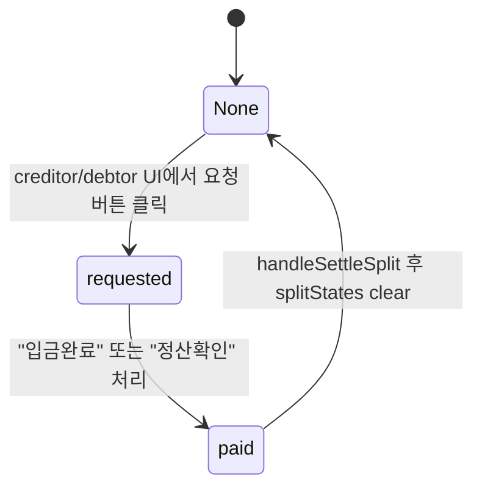

# [LLD] HANS SNS 정산 상세 설계 (Reverse Engineering)

## 1. 도메인 개요
정산 기능은 두 데이터 소스로 계산됩니다.
1. `posts`의 `totalExpense` (해당 post가 group에 속하면 groupId로 묶임)
2. `expenses` 컬렉션의 직접 지출 내역 (채팅 모달/정산 상세에서 추가)

그 후 계산 결과로 멤버별 잔액(balances)과 송금 관계(splits)가 생성됩니다.

## 2. 핵심 모듈
- `src/core/firebase/settlementService.ts`
  - `calculateGroupSettlement(groupId)`
  - `addExpense(expense)`
  - `markSplitAsSettled(groupId, fromUserId, toUserId, amount)`
  - `deleteExpense(expenseId)`

## 3. calculateGroupSettlement 알고리즘(코드 기준)
### 3.1 입력 데이터
- `groupService.getGroup(groupId)`로 `members[]` 획득
- `posts`:
  - `where("groupId","==",groupId)`로 모든 post 조회
- `expenses`:
  - `where("groupId","==",groupId)`로 모든 expense 조회

### 3.2 합산 규칙(코드 관찰)
- posts 처리:
  - 각 post의 `amount = post.totalExpense`를 합산
  - `paidBy = post.user.uid`이면 paidAmounts[paidBy] 증가
  - `totalShouldPay`는 “현재 group members 모두에게 균등 분배” (post별 `participants`가 없음)
- expenses 처리:
  - expense.title이 `"정산 완료"`이면 총액(totalAmount)에 포함하지 않음(이미 정산된 balancing payment 제외)
  - `participants`가 비어있거나 없으면 기본값으로 `members`에 균등 분배
  - `splitAmount = amount / participants.length`로 `totalShouldPay` 누적

### 3.3 잔액/송금 관계 계산
- balance:
  - `balances[uid] = round(paidAmounts[uid] - totalShouldPay[uid])`
- splits:
  - debtors (balance < 0)와 creditors (balance > 0)를 greedy 매칭
  - `toPay = min(abs(debtorBalance), creditorBalance)`
  - 거래 amount는 `Math.round(toPay)`
  - tiny amount(약 1원 이하)는 skip하는 로직 존재

## 4. split 상태 전이(state)와 저장 위치
split의 요청/입금 상태는 `groups.splitStates`에 저장됩니다.
- key: `${fromUserId}_${toUserId}`
- values:
  - `requested`
  - `paid`
  - 삭제(null 처리): 코드에서 `deleteField()` 사용

### Mermaid (상태 전이)

## 5. 정산 요청/입금 확인 흐름(프론트 기준)
### 5.1 요청하기
- `src/app/(main)/settlement/[id]/page.tsx`
  - split.toUserId가 “현재 사용자”인 경우:
    - 정산 요청 버튼:
      1) `notificationService.sendSettlementNotifications(...)` 전송
      2) `groupService.updateSplitState(groupId, fromUserId, currentUser.uid, 'requested')`

### 5.2 입금완료/정산확인
- `src/app/(main)/settlement/[id]/page.tsx`
  - debtors view: split.fromUserId == currentUser.uid
    - `"입금완료"` 클릭 시:
      - `groupService.updateSplitState(groupId, currentUser.uid, split.toUserId, 'paid')`
      - `notificationService.sendSettlementPaymentNotification(split.toUserId, ...)`
  - creditors view: split.toUserId == currentUser.uid
    - `"정산확인"` 클릭 시:
      - `settlementService.markSplitAsSettled(...)`로 balancing expense 추가
      - `groupService.updateSplitState(groupId, split.fromUserId, currentUser.uid, null)`로 clear

## 6. 메시지(채팅) 연계
- `src/app/(main)/messages/[id]/page.tsx` 및 정산 상세 화면에서 settlement 관련 행동을 수행할 때:
  - 채팅 메시지 type `"settlement"` 을 사용해 상대에게 요청 내용을 기록
  - 상대 채팅 화면에서 type `"settlement"` 수신 후:
    - `messageService.markSettlementAsPaid`로 메시지에 isSettled=true 처리
    - `notificationService.sendSettlementPaymentNotification`을 호출하여 요청자에게 완료 알림 전송

## 7. Reverse Engineering 관찰 포인트(문서상 주의)
- 계산식은 “posts의 totalExpense를 group members 모두 균등 분배”하는 단순 모델입니다.
- UI에서 직접 지출(expenses)은 participant 선택이 가능하므로 posts와 expenses 간 분배 정책이 다릅니다.

---
다음 단계로 `doc/requirements/`의 PRD 문서를 “현재 코드의 실제 기능” 기준으로 재정리하겠습니다.

