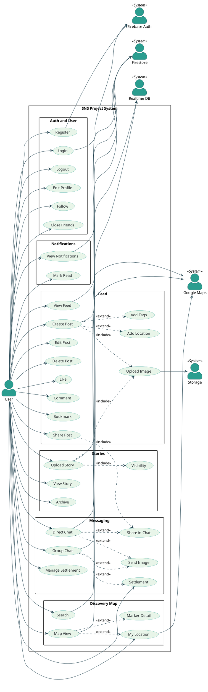

# SNS 프로젝트 유스케이스 다이어그램

## 👀 다이어그램 보는 방법

### 방법 1: HTML 뷰어 (권장)
[usecase-diagram.html](./usecase-diagram.html) 파일을 **브라우저에서 열면** PlantUML 서버를 통해 자동으로 다이어그램이 렌더링됩니다.

### 방법 2: VS Code 확장 프로그램
1. VS Code에서 `PlantUML` 확장 프로그램 설치 (jebbs.plantuml)
2. [usecase-diagram.puml](./usecase-diagram.puml) 파일을 열기
3. `Alt + D` 를 눌러 미리보기

### 방법 3: PlantUML 온라인 서버
1. [PlantUML Online Server](https://www.plantuml.com/plantuml/uml) 접속
2. 아래 PlantUML 코드를 전체 복사하여 붙여넣기
3. `Submit` 클릭

---

## PlantUML 소스 코드

---

## 주요 액터

| 액터 | 설명 |
|---|---|
| **User (일반 사용자)** | SNS 서비스를 이용하는 모든 등록 사용자 |
| **Firebase Auth** | 이메일/구글 기반 인증 처리 |
| **Firestore** | 게시물, 스토리, 알림 등 문서 데이터 저장 |
| **Storage** | 이미지 파일 업로드/다운로드 |
| **Realtime DB** | 실시간 채팅 메시지 처리 |
| **Google Maps** | 지도 렌더링 및 위치 서비스 |

## 패키지 구성

| 패키지 | 유스케이스 수 | 핵심 기능 |
|---|---|---|
| Auth and User | 6 | 회원가입, 로그인, 프로필, 팔로우 |
| Feed | 11 | 게시물 CRUD, 좋아요, 댓글, 북마크, 공유 |
| Stories | 4 | 스토리 업로드, 24시간 만료, 보관함 |
| Messaging | 6 | 1:1 채팅, 그룹 채팅, 정산 |
| Discovery Map | 4 | 지도 탐색, 검색, 현재 위치 |
| Notifications | 2 | 알림 조회, 읽음 처리 |
